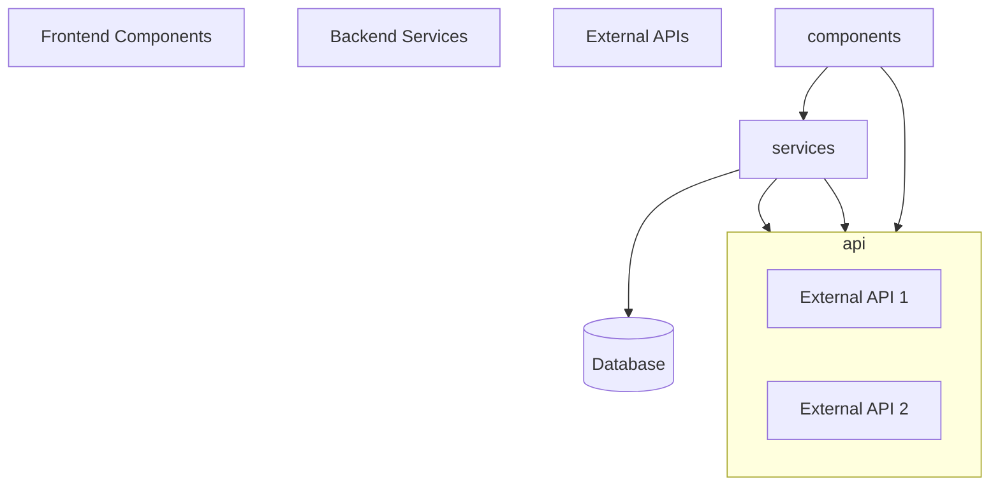

# Component Architecture

```mermaid
graph TB
    front-end-components[Frontend Components]
    backend-services[Backend Services]
    database[(Database)]
    external-apis[External APIs]
    
    components-->services
    services-->database
    services-->api
    
    classDef component-color fill:#f9f9f9,stroke:#333,color:#333
    class backend-service component-color
    class database-text fill:#333
    
    subgraph api
        api-1[External API 1]
        api-2[External API 2]
    end

    components-->api
    services-->api
```