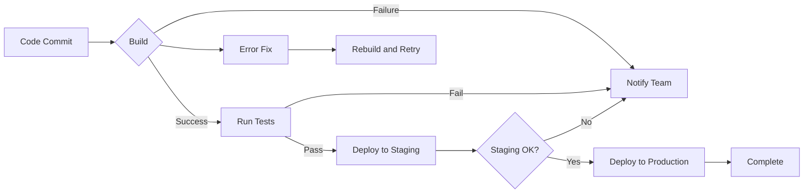

# Deployment Pipeline

```mermaid
flowchart LR
    A[Code Commit] --> B{Build}
    B -->|Success| C[Run Tests]
    B -->|Failure| D[Notify Team]
    C -->|Pass| E[Deploy to Staging]
    C -->|Fail| D
    E --> F{Staging OK?}
    F -->|Yes| G[Deploy to Production]
    F -->|No| D
    G --> H[Complete]
    B --> I[Error Fix]
    I --> J[Rebuild and Retry]
```