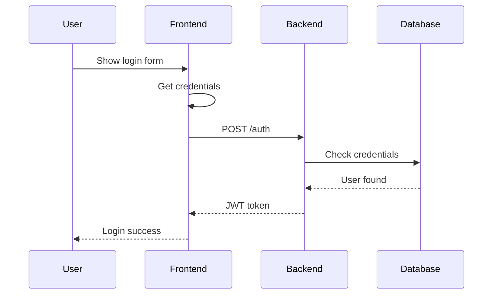

# User Authentication Flow

```mermaid
sequenceDiagram
    participant User
    participant Frontend
    participant Backend
    participant Database
    
    User->>Frontend: Show login form
    Frontend->>Frontend: Get credentials
    Frontend->>Backend: POST /auth
    Backend->>Database: Check credentials
    Database-->>Backend: User found
    Backend-->>Frontend: JWT token
    Frontend-->>User: Login success
```